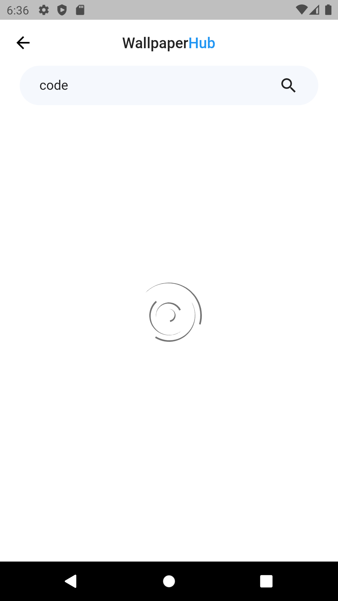
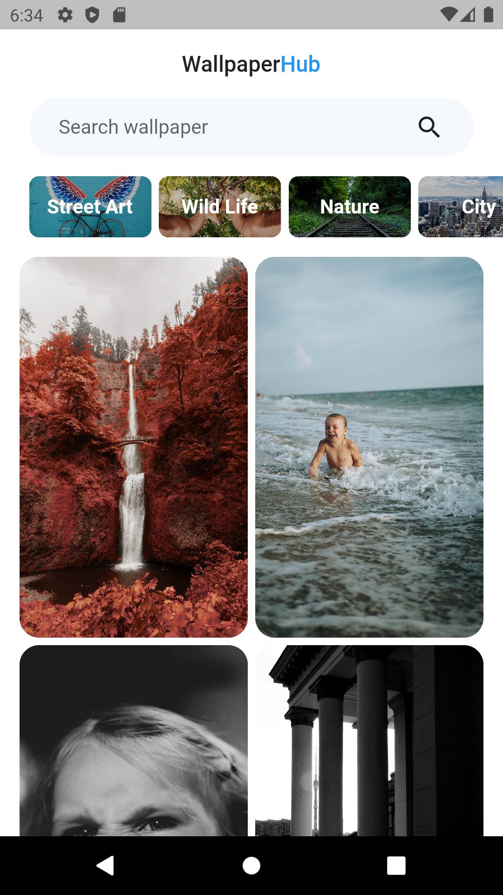
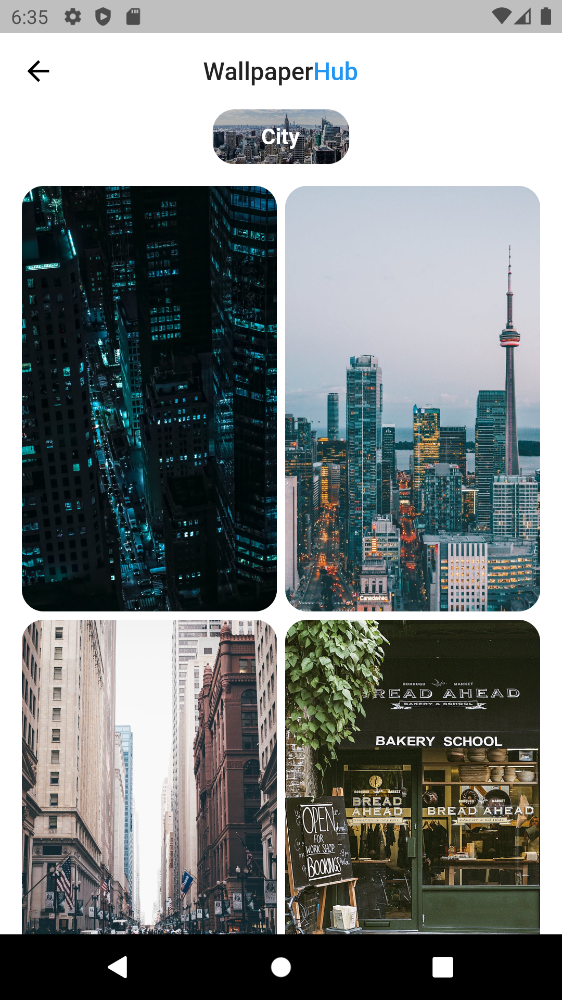
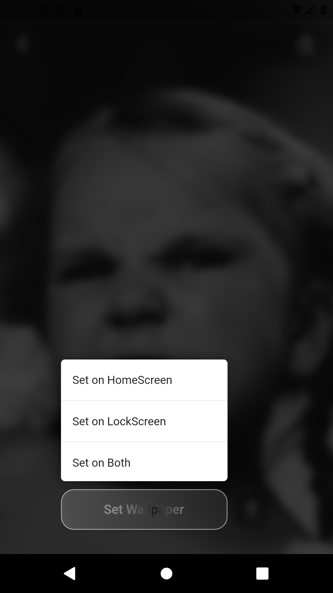
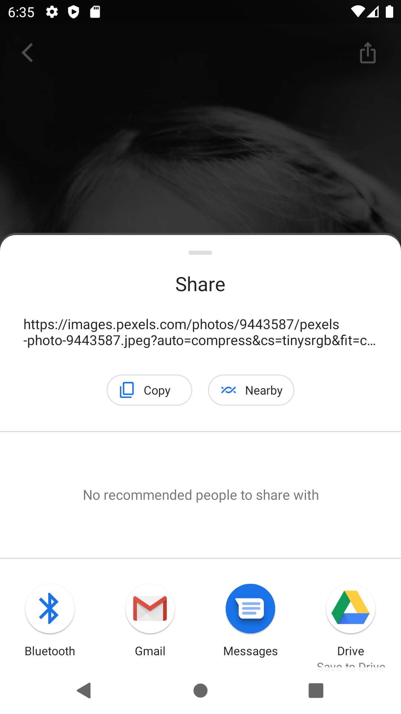
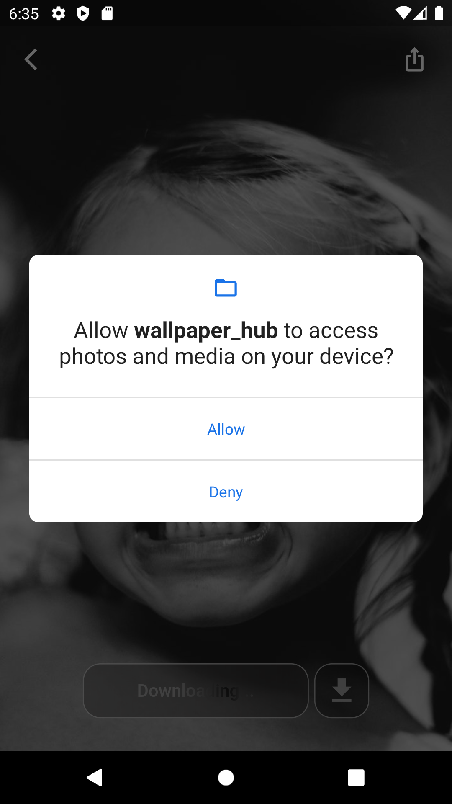
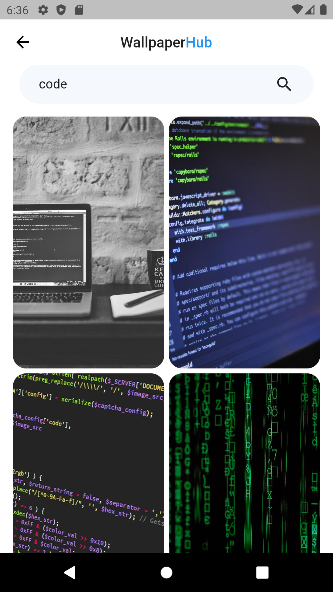
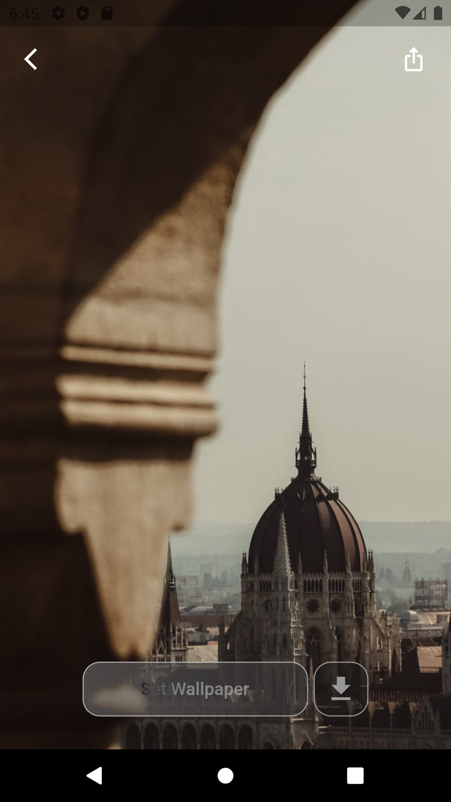

# Wallpaper Hub

This is my flutter project where I have learned about API & http connection. I have learn here how to control Hero Animation and also used Grid View and Cached Network Image Package for Viewing Image form network !!! This is fully functional Wallpaper app for Android, iOS and Web.

Check in Live with Web: <b><a href="https://karno786.github.io/Wallpaper-Hub-Web" target="_blank">Wallpaper Hub Web</a></b>

# Screenshots:

| Web and Android Screen |
| :----:   |
|  |

| Loading Screen      |  Home Screen |  Category Screen |
| :---:       |    :----:   | :----:   |
|        |       |    |

| SetWallpaper Screen     |  Share Screen |  Save Screen |
| :---:       |    :----:   | :----:   |
|        |       |    |

| Search Screen     |  ImageView Screen |  
| :---:       |    :----:   | 
|       |       |  

|  WebView Home Screen     |   WebView Error Screen |  
| :---:       |    :----:   | 
|      |       |  

### Disclaimer
This project is made only for educational purpose. Anyone can use it but the risk has to be taken by the user.
for any query please contact me.

### Repository Owner Info

__Md. Al-Amin__  
__Email :__ [ alamin.karno@outlook.com ](mailto:alamin.karno@outlook.com)  
__Github :__ [Md. Al-Amin](https://github.com/alamin-karno) 
__Facebook :__ [মোঃ আল-আমিন খন্দকার কর্ণ](https://facebook.com/alamin.kanro786)  
__Linkedin :__ [Md. Alamin Karno](https://www.linkedin.com/in/alaminkarno/)
 
 

